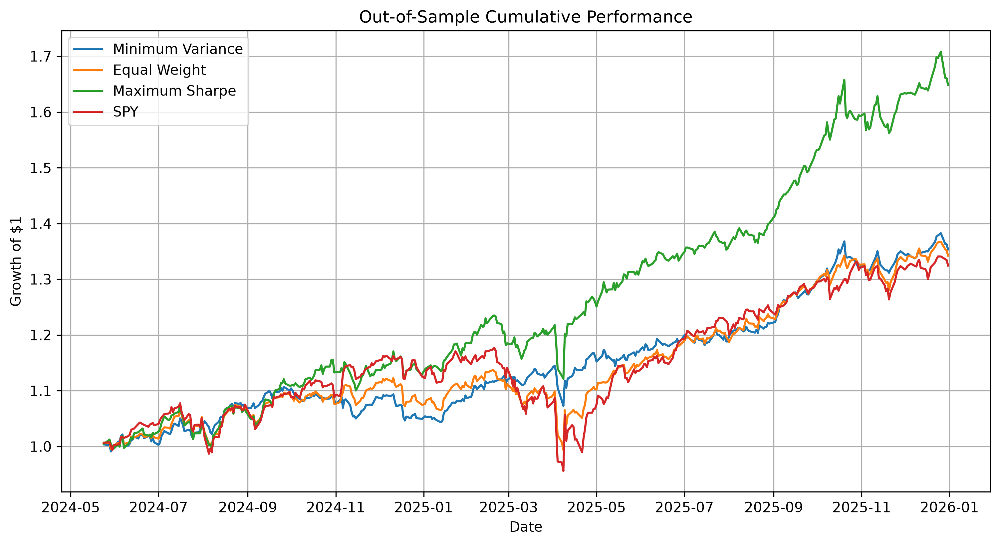
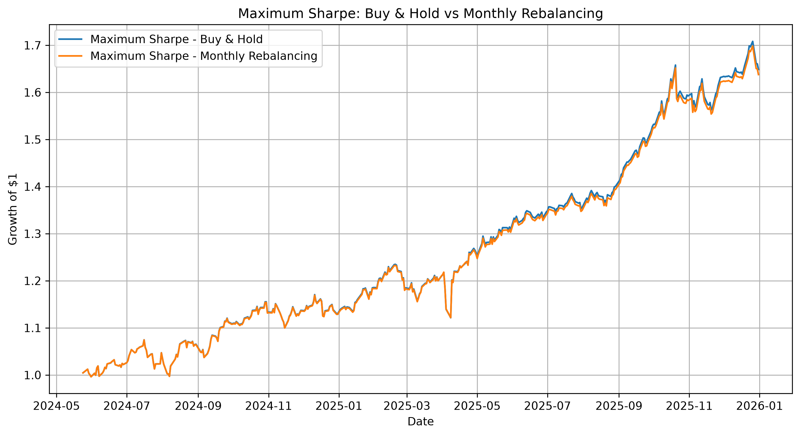
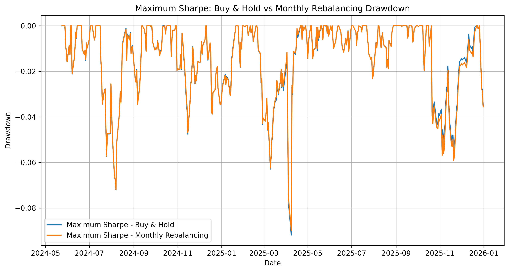
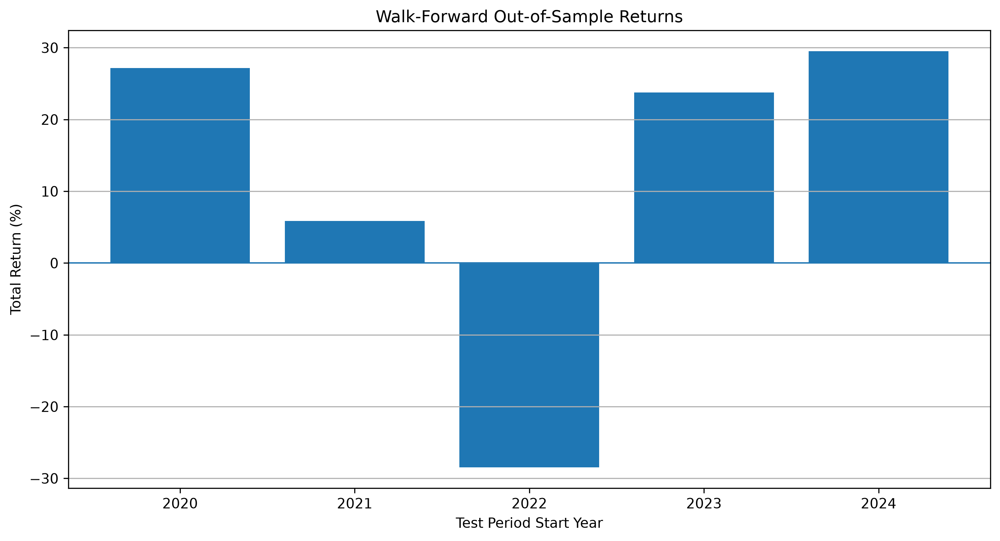
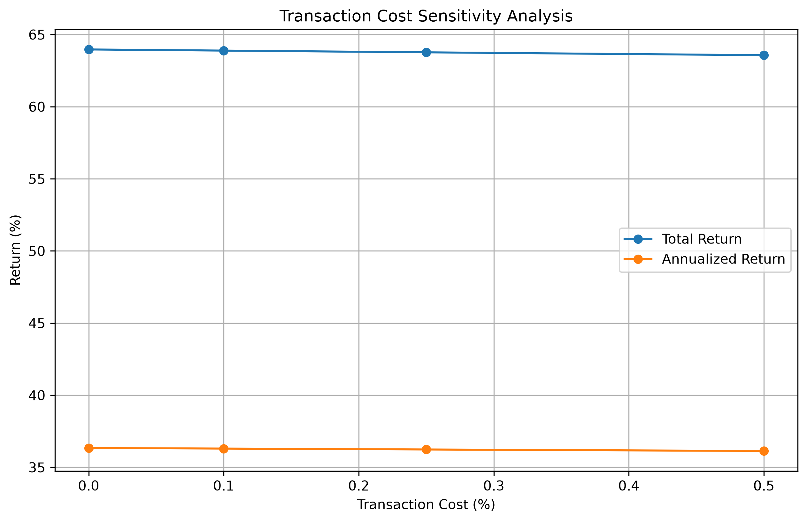

# Financial Portfolio Optimization

I built this project to learn how portfolio optimization works in practice
and to see how different portfolio construction methods behave on historical
market data.

The main question I wanted to explore was:

Can portfolio optimization improve risk-adjusted performance compared with
a simple equal-weight portfolio and a broad-market benchmark?

---

## What I Did

I used six ETFs representing different parts of the market:

- SPY — U.S. large-cap equities
- QQQ — U.S. technology / growth equities
- IWM — U.S. small-cap equities
- TLT — Long-term U.S. Treasury bonds
- GLD — Gold
- EFA — International developed-market equities

The dataset contains daily prices from 2018 to 2025.

I started with basic return, volatility, correlation, and covariance analysis,
then used the covariance matrix to construct optimized portfolios.

The main strategies I tested were:

1. Equal Weight
2. Minimum Variance
3. Maximum Sharpe
4. Maximum Sharpe with monthly rebalancing

I also compared the portfolios with SPY.

---

## Portfolio Optimization

### Minimum Variance

The minimum variance portfolio solves:

$$
\min_w w^T \Sigma w
$$

subject to:

$$
\sum_i w_i = 1
$$

and

$$
0 \leq w_i \leq 1
$$

This gives a long-only portfolio that minimizes estimated portfolio
variance.

### Maximum Sharpe

The Maximum Sharpe portfolio maximizes:

$$
Sharpe = \frac{R_p}{\sigma_p}
$$

under the same long-only constraints.

The optimization was performed using `scipy.optimize.minimize` with SLSQP.

---

## Backtesting

I split the data into training and testing periods so that portfolio weights
were estimated using historical data only.

The main test period was kept completely out-of-sample.

For each strategy, I calculated:

- Total return
- Annualized return
- Annualized volatility
- Sharpe ratio
- Maximum drawdown

The portfolio returns were compounded over time to track the growth of an
initial $1 investment.

---

## Monthly Rebalancing

After finding the Maximum Sharpe portfolio, I also tested what happens when
the portfolio is rebalanced at the end of each month.

Because assets have different returns, portfolio weights naturally drift
over time. Monthly rebalancing brings the portfolio back toward its target
weights.

I used a transaction-cost assumption of 0.25% per unit of turnover.

The average monthly turnover in the test period was approximately 2.43%.

---

## Transaction Cost Sensitivity

I tested four transaction-cost assumptions:

| Transaction Cost | Total Return | Annualized Return | Sharpe |
|---:|---:|---:|---:|
| 0.00% | 63.97% | 36.34% | 2.470 |
| 0.10% | 63.89% | 36.30% | 2.467 |
| 0.25% | 63.77% | 36.24% | 2.463 |
| 0.50% | 63.57% | 36.13% | 2.456 |

The results changed gradually as transaction costs increased.

---

## Walk-Forward Analysis

A single train/test split can make a strategy look better or worse depending
on the selected period, so I also ran a walk-forward analysis.

For each iteration, I used approximately two years of historical data to
estimate the Maximum Sharpe portfolio and then tested it on the following
year.

This produced five out-of-sample periods:

| Test Period | Return | Volatility | Sharpe | Max Drawdown |
|---|---:|---:|---:|---:|
| 2020–2021 | 27.19% | 13.49% | 2.016 | -13.00% |
| 2021–2022 | 5.85% | 10.41% | 0.562 | -9.32% |
| 2022–2023 | -28.47% | 20.29% | -1.403 | -31.39% |
| 2023–2024 | 23.78% | 13.02% | 1.826 | -10.00% |
| 2024–2025 | 29.51% | 14.14% | 2.087 | -7.42% |

The results varied substantially between periods. In particular, the
2022–2023 period produced a large loss.

This was useful because it showed that the optimization results are not
consistent across every market environment.

---

## Results

The main out-of-sample analysis compares the optimized portfolios with
simple benchmarks using both return and risk measures.

I focused on risk-adjusted performance rather than looking only at total
return.

---

### Out-of-Sample Performance



### Buy & Hold vs Monthly Rebalancing



### Drawdown



### Walk-Forward Performance



### Transaction Cost Sensitivity



---

## what I learned

This project helped me understand how portfolio optimization connects
statistics, linear algebra, and numerical optimization.

One of the main things I learned was that a high in-sample Sharpe ratio does
not necessarily mean that a strategy will perform consistently out of sample.

The walk-forward results made this especially clear.

I also learned that portfolio weights can change substantially over time
without any explicit trading, simply because different assets have different
returns.

---

## Tools

- Python
- NumPy
- Pandas
- SciPy
- Matplotlib
- yfinance
- Jupyter Notebook

---

## Project Structure

```text
financial-portfolio-optimization/
├── data/
│   └── close_prices.csv
├── notebooks/
│   └── 01_data_exploration.ipynb
├── results/
│   ├── out_of_sample_performance.png
│   ├── buy_hold_vs_rebalancing.png
│   ├── buy_hold_vs_rebalancing_drawdown.png
│   ├── transaction_cost_sensitivity.png
│   ├── walk_forward_returns.png
│   └── walk_forward_sharpe.png
├── src/
└── README.md
